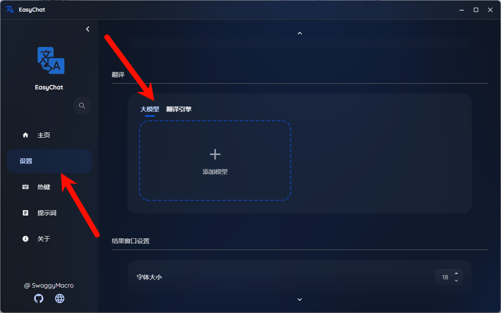
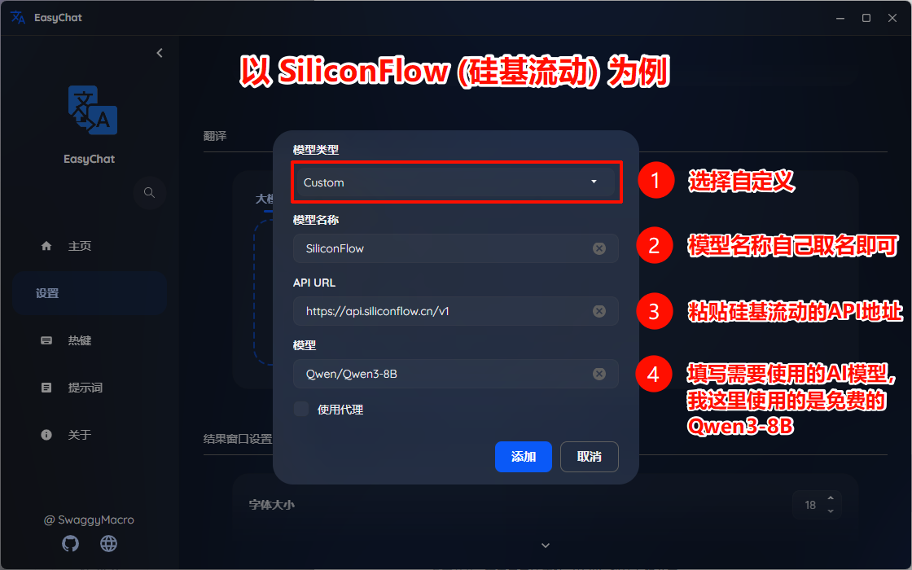
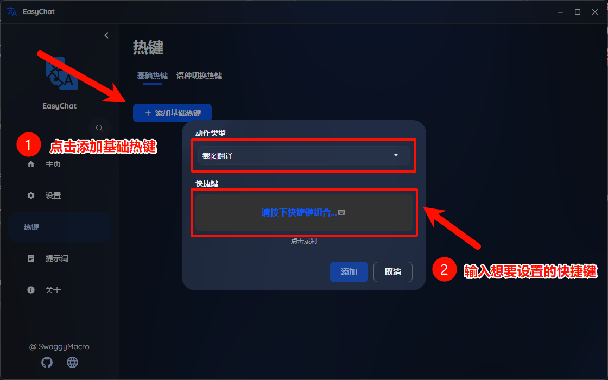
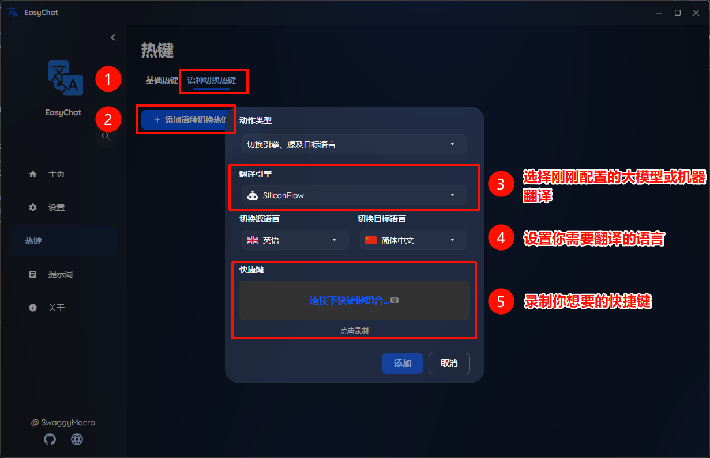

# EasyChat

EasyChat 是一款基于 Avalonia 开发的跨平台即时翻译工具，是继 2018 年高中时期使用易语言开发的“交流神器”（原官网 https://f.julym.com）后的第三次重构版本。
本项目旨在提供更流畅、更现代化的跨语言交流体验。

## ✨ 核心功能

本软件核心功能专注于解决高频跨语言交流场景：

1.  **截图 OCR 翻译**
    *   按下快捷键框选屏幕区域，自动识别图片中的文本并快速翻译成目标语言，结果直接悬浮显示。
2.  **输入自动翻译**
    *   在任意聊天软件对话框中按下快捷键，唤出输入窗口。
    *   输入你的母语（如中文），软件自动翻译成目标语言（如英语、日语等）。
    *   翻译完成后，自动将译文投递并发送到原对话框中，实现无缝沟通。

## 🤖 翻译引擎支持

由于软件为开源项目，用户需要自行配置翻译服务的 API Key。目前支持主流 AI 大模型与传统机器翻译：

### AI 大模型 (推荐)
支持自定义提示词（Prompt），可完美解决特定领域术语翻译不准确的问题（如游戏术语 CS2、编程术语等）。

*   **推荐渠道**: [硅基流动 (SiliconFlow)](https://cloud.siliconflow.cn/i/x8pm79KY)
    *   *优势*: 提供多种免費的小参数量模型，且翻译质量和速度完全满足日常使用。

### 机器翻译
*   **百度翻译**: [申请地址](https://fanyi-api.baidu.com/product/11)
    *   个人认证用户：100万免费字符/月
    *   企业认证用户：200万免费字符/月
*   **腾讯翻译君**: [申请地址](https://cloud.tencent.com/document/product/551)
    *   免费额度：500万字符/月

## 🛠️ 技术栈

本项目使用现代 .NET 技术栈构建，致力于未来的跨平台支持：
*   **核心框架**: [Avalonia UI](https://avaloniaui.net/) (为后续跨平台支持做准备)
*   **UI 组件库**: [SukiUI](https://github.com/kikipoulet/SukiUI)
*   **OCR 引擎**: [PaddleOCR](https://github.com/PaddlePaddle/PaddleOCR)

## 📖 使用教程

1.  **下载运行**: 
    *   在 [Releases](../../releases) 页面下载最新版本的压缩包。
    *   解压后找到 `EasyChat.exe` 双击运行。
2.  **配置翻译源**:
    *   打开软件设置。
    *   配置任意一个 AI 大模型或机器翻译平台的 API Key。
    
    
3.  **设置快捷键**:
    *   **基础热键**: 在设置中添加“截图翻译”和“输入翻译”的全局热键。
    
    *   **语种切换热键**: 
        *   添加一个新的切换配置。
        *   选择已配置好的翻译引擎。
        *   设定源语言和目标语言（例如：源语言 English -> 目标语言 Chinese）。
        *   *逻辑说明*:在此配置下，截图翻译会将 English 翻译为 Chinese；输入翻译时，你输入 Chinese，软件将其翻译为 English。
    
4.  **开始使用**:
    *   **截图翻译**: 按下设定的截图翻译热键，框选屏幕区域，等待翻译结果悬浮显示。
    *   **输入翻译**: 在聊天窗口按下输入翻译热键，输入母语文本，等待译文自动发送。
    *   **切换语种**: 在需要切换翻译语种时，按下设定的语种切换热键。

### 📹 使用视频  

https://github.com/user-attachments/assets/6ab9b6a3-446d-403a-b37a-d49b39c0f9d3

### 💡 进阶功能：自定义 Prompt
目前软件支持大模型提示词（Prompt）配置。你可以针对特定场景优化翻译结果。
*   *案例*: 添加 CS2 游戏提示词，防止 AI 将游戏术语 "dinked" 直译为 "打头一枪"，而是输出准确的游戏术语。

## 🚀 开发计划 (Roadmap)

项目目前已完善基础功能，后续将持续迭代开发，计划加入以下功能：

- [ ] **划词翻译**: 选中文本直接进行翻译。
- [ ] **词典功能**: 截图后可点击单词查看详细解释、例句、发音及音标。
- [ ] **实时语音翻译**: 实时识别语音并翻译。
- [ ] **固定区域翻译**: 设定特定屏幕区域，快捷键一键翻译（适用于 Galgame 等场景）。
- [ ] **同色系遮罩**: 截图翻译后，使用背景同色遮罩覆盖原文并显示译文，提供更沉浸的阅读体验。

## 🤝 参与贡献

如果你对本项目感兴趣，欢迎提交 PR (Pull Request) 改进代码或增加新功能。

## ⭐ 支持项目

如果 `EasyChat` 觉得对你有帮助，欢迎点击项目右上角的 **Star** ⭐ 支持作者！您的支持是我持续开发和维护的最大动力。
